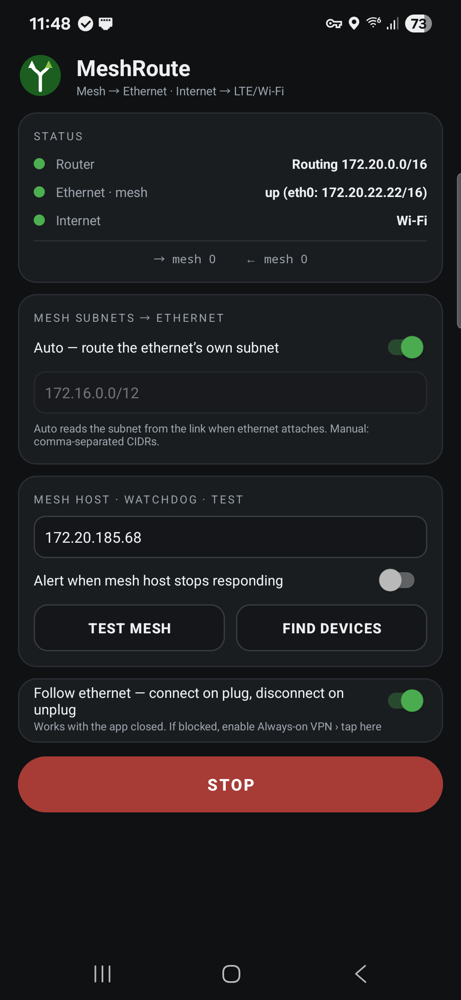

# MeshRoute

**Split-tunnel mesh router for Android** — connect your phone to a WAN-less
MANET radio (Silvus StreamCaster, Doodle Labs Mesh Rider, etc.) over USB-C
ethernet *or* the radio's Wi-Fi, while LTE/5G keeps carrying your internet.
The dual-network behavior desktops have always had, on a Samsung in your pocket.

Functionally equivalent to the simultaneous dual-connection (MANET + LTE)
feature of the Samsung Galaxy **Tactical Edition** models — but on standard
consumer and enterprise hardware.

No root. No system modification. Works on managed/Knox devices.

  

## The problem

Android routes all traffic over one "default network." Connect a mesh radio
that has no internet and one of two bad things happens: Android keeps
LTE/Wi-Fi as default and packets to mesh hosts go out the wrong interface and
die, or the mesh link grabs the default slot and your internet dies. There is
no user-facing way to add a static route.

## What MeshRoute does

MeshRoute registers a VPN whose tunnel claims **only the mesh subnet**. Traffic
to mesh hosts is forwarded out the mesh interface; everything else never
touches the tunnel and rides your normal internet connection untouched — for
every app on the phone, with no per-app configuration.

- **Three ways to reach the mesh** — USB-C ethernet, a Wi-Fi network you
  designate as the mesh, or a radio hotspot the app joins itself (local-only,
  never competes for the internet slot).
- **Auto subnet** — reads the subnet from the mesh link when it attaches.
  Connect any radio and it routes; no CIDRs to type (manual override available).
- **Follow the link** — connects when the mesh appears, disconnects when it
  goes, arms itself at boot and works with the app closed.
- **Internet rescue** — if the WAN-less mesh link wins Android's default-network
  slot (unavoidable with static-IP radios that require accepting the "no
  internet" prompt), MeshRoute carries all non-mesh traffic over cellular
  itself, so your internet keeps working. Reverts automatically.
- **Scan & pick** — list nearby networks and tap the radio's hotspot; security
  type is detected automatically.
- **Find Devices** — scans the mesh subnet and lists every live node with
  latency; tap one to set it as your monitored host.
- **Test Mesh** — one-tap field diagnostic: link state, ping, TCP probe, and a
  plain-language verdict ("mesh link healthy" / "nothing answering — check
  radio power and IP").
- **Watchdog** — pings your mesh host every 30 s and fires a notification the
  moment the mesh goes silent.
- **Home-screen widget** — one-tap start/stop with live status.
- TCP, UDP, and ICMP (ping) forwarding via userspace relays bound to the mesh
  network. MSS clamping and upload backpressure built in.

## What it deliberately does not touch

- **Multicast (224.0.0.0/4)** — left native so interface-aware apps (e.g. ATAK
  multicast SA) keep working directly on the mesh interface.
- **IPv6** — bypasses the tunnel entirely.
- **Your default network** — outside of rescue mode, internet routing is never
  modified.

## Install

1. Grab the APK from [Releases](../../releases) and sideload it
   (`adb install MeshRoute-*.apk` or open it on the phone).
2. Open the app once, pick how the mesh is connected, and tap **START**,
   accepting the VPN prompt (one time only). From then on it follows the link
   automatically.
3. Recommended: set the app's battery usage to **Unrestricted** so aggressive
   battery management can't kill the background service.

### Picking a link mode

| Radio | Mode |
|---|---|
| USB-C ethernet adapter | **Ethernet cable** |
| Wi-Fi hotspot, DHCP | **Wi-Fi — connect via app** (cleanest: no prompts, never takes the default slot) |
| Wi-Fi hotspot, static IP only | Add it in Android Wi-Fi settings with the static address, then **Wi-Fi — current network**. Accepting Android's "no internet" prompt is fine — rescue mode keeps your internet alive over LTE. |

## Notes

- Requires Android 10+. Built for Samsung devices (XCover, S-series); should
  work on any modern Android with USB-C ethernet or Wi-Fi.
- Idle battery use is negligible — the standby watcher is event-driven, and
  the packet loop sleeps unless traffic is actually flowing.
- The status bar's link icon is drawn by the OS and reflects link state, not
  routing; the app's **Internet** row shows where your traffic really goes.
- Works with DHCP or static configurations. No gateway or DNS is needed on the
  mesh link — the tunnel only routes the on-link subnet.
